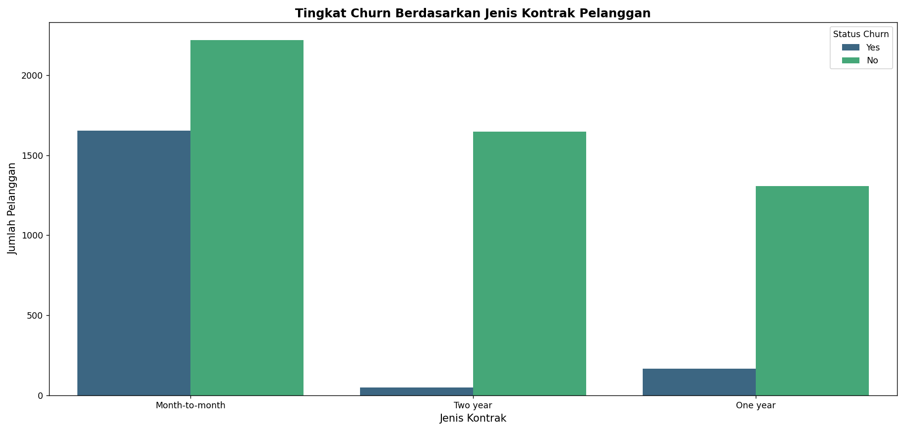
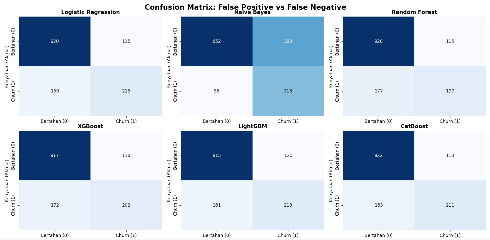
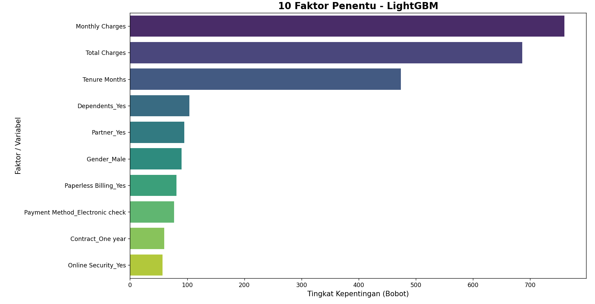

# Telco Customer Churn Prediction 📉
End-to-End Data Analytics & Machine Learning Model untuk memprediksi probabilitas Telco Customer Churn guna mendukung optimalisasi strategi pemasaran dan retensi pelanggan.

## 📌 Latar Belakang & Tujuan Bisnis
Di industri telekomunikasi, mempertahankan pelanggan lama jauh lebih murah daripada mengakuisisi pelanggan baru. Proyek ini bertujuan untuk membangun model Machine Learning yang mampu mendeteksi pelanggan mana yang berpotensi untuk berhenti berlangganan (*churn*), sehingga tim pemasaran dapat melakukan intervensi preventif berupa penawaran promo atau diskon loyalitas secara tepat sasaran.

## 📊 Eksplorasi Data (EDA)
Dataset ini memiliki tantangan berupa kelas target yang tidak seimbang (*Imbalanced Data*), di mana jumlah pelanggan yang *churn* jauh lebih sedikit.
_vs_Bertahan.png)

Selain itu, analisis menunjukkan bahwa pelanggan dengan kontrak **Month-to-month** memiliki tingkat *churn* yang jauh lebih masif dibandingkan kontrak tahunan.

## 🤖 Evaluasi Model Machine Learning
Proyek ini menguji 6 algoritma Machine Learning. Karena data tidak seimbang, evaluasi difokuskan pada nilai **Recall** dan **F1-Score** untuk meminimalkan *False Negative* (mesin gagal mendeteksi pelanggan yang kabur).
*   **Logistic Regression** dan **CatBoost** memberikan keseimbangan metrik terbaik di kisaran F1-Score ~60-61%.
*   Algoritma *tree-based* (seperti LightGBM dan CatBoost) menunjukkan ketangguhan luar biasa dalam menekan *False Negative* pada *Confusion Matrix*.

## 💡 Wawasan Bisnis (Business Insights) & Rekomendasi

Berdasarkan ekstraksi **Feature Importance** dari model LightGBM (yang polanya juga tervalidasi secara konsisten oleh algoritma XGBoost, CatBoost, dan Random Forest), terungkap 3 pemicu utama *churn*:

1. **Total Charges & Monthly Charges:** Tagihan bulanan yang dirasa terlalu tinggi/membengkak.
2. **Tenure Months:** Pelanggan baru (umur langganan pendek) sangat rentan untuk pindah operator.
3. **Internet Service (Fiber Optic) & Contract:** Pengguna Fiber Optic tanpa ikatan kontrak tahunan adalah kelompok paling berisiko.

**Kesimpulan dan Analisis:**
Perusahaan harus memfokuskan anggaran retensi untuk memberikan promo khusus atau diskon peningkatan layanan pada pelanggan baru di bulan ke-2 hingga ke-6 berlangganan, terutama membujuk mereka agar beralih dari kontrak bulanan menjadi kontrak 1 tahun.
