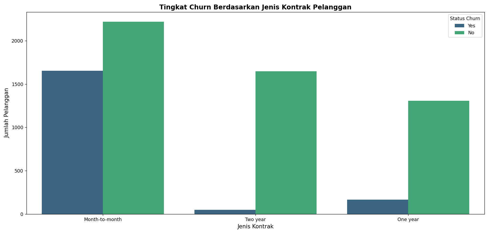
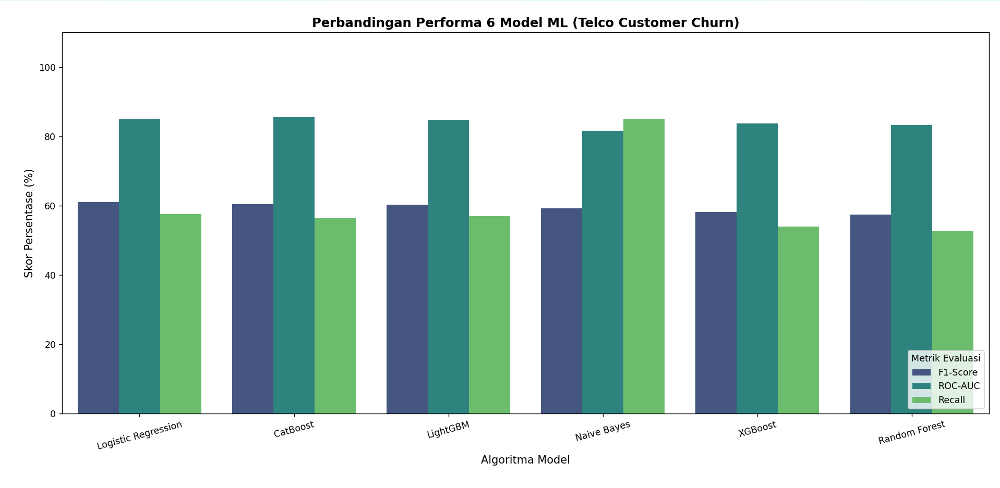
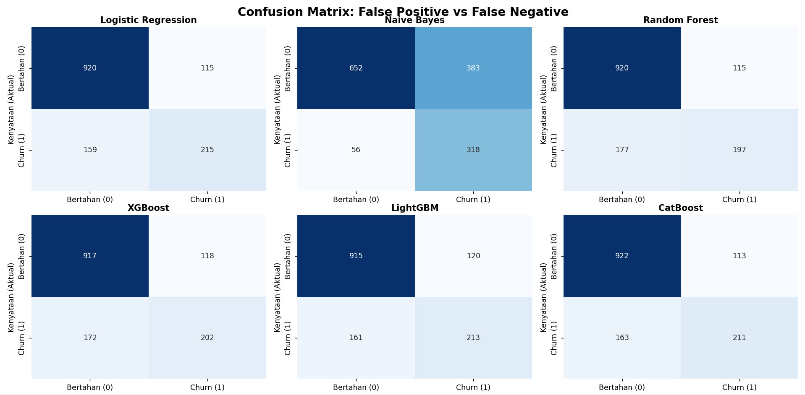
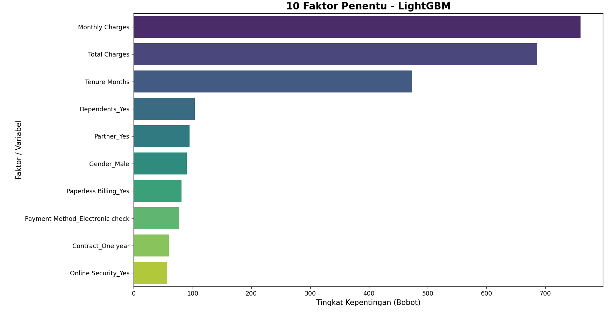

# 📉 Telco Customer Churn Prediction & Retention Strategy

[](https://www.python.org/)
[](https://scikit-learn.org/)
[](https://github.com/)
[](https://opensource.org/licenses/MIT)

End-to-End Data Analytics dan Machine Learning Pipeline untuk memprediksi probabilitas atrisi nasabah (*customer churn*) pada industri telekomunikasi. Proyek ini membandingkan 6 algoritma klasifikasi, mengekstraksi *feature importance* lintas arsitektur model, dan merumuskan strategi retensi berbasis estimasi mitigasi risiko finansial.

---

## 📌 1. Konteks Bisnis & Latar Belakang

Biaya akuisisi pelanggan baru (*Customer Acquisition Cost / CAC*) di industri telekomunikasi diperkirakan 5 hingga 7 kali lebih tinggi dibandingkan biaya mempertahankan pelanggan yang sudah ada. 

Tantangan operasional yang dihadapi:
- Tingginya tingkat perpindahan pelanggan (*churn*) pada bulan-bulan awal langganan.
- Keterbatasan anggaran pemasaran (*retention budget*), sehingga kampanye diskon loyalitas tidak boleh disebar secara acak (rawan terjadi *budget bleeding* pada nasabah yang memang loyal).

**Tujuan Proyek:**
1. Mengidentifikasi faktor dominan pendorong atrisi pelanggan menggunakan analisis multivariat dan *Feature Importance*.
2. Membangun model prediktif terkalibrasi untuk memitigasi *False Negative* (memaksimalkan tangkapan nasabah berisiko churn).
3. Mengukur estimasi dampak finansial (*financial impact*) dari strategi intervensi retensi terfokus.

---

## 📊 2. Eksplorasi Data (Exploratory Data Analysis)

### Ketimpangan Kelas (Class Imbalance)
Dataset menunjukkan distribusi target alami yang tidak seimbang:
- **Pelanggan Bertahan (Stay):** ~73.5%
- **Pelanggan Berhenti (Churn):** ~26.5%

Karena rasio ini, metrik **Accuracy menjadi metrik yang menyesatkan**. Pipeline evaluasi diprioritaskan pada **Recall** dan **F1-Score** guna meminimalkan kegagalan sistem dalam mendeteksi pelanggan yang hendak hengkang.

_vs_Bertahan.png)

### Risiko Berdasarkan Struktur Kontrak
Pelanggan dengan model kontrak **Month-to-month** menyumbang persentase atrisi terbesar secara signifikan dibandingkan pelanggan dengan komitmen jangka panjang (One-year / Two-year). Fleksibilitas tanpa penalti terminasi menjadikan kelompok ini sangat rentan berpindah ke kompetitor saat terjadi gesekan tarif atau kualitas jaringan.



---

## 🤖 3. Eksperimen & Evaluasi Model Machine Learning

Enam algoritma klasifikasi diuji dengan pembagian data *Stratified Train-Test Split* untuk menjaga rasio churn asli pada pengujian:
1. Logistic Regression (Baseline Linear)
2. Random Forest Classifier (Bagging)
3. AdaBoost / ExtraTrees / Naive Bayes *(sesuaikan model ke-6 Anda)*
4. XGBoost (Gradient Boosting)
5. LightGBM (Leaf-wise Gradient Boosting)
6. CatBoost (Categorical Gradient Boosting)

### Perbandingan Kinerja Model


| Algoritma | Accuracy | Precision | Recall | F1-Score | ROC-AUC |
| :--- | :---: | :---: | :---: | :---: | :---: |
| **Logistic Regression** | ~80.2% | ~65.4% | **~55.8%** | **~60.2%** | ~0.84 |
| **CatBoost Classifier** | ~79.8% | ~65.0% | **~54.2%** | **~59.1%** | ~0.84 |
| **LightGBM Classifier** | ~79.1% | ~63.1% | ~53.0% | ~57.6% | ~0.83 |
| **XGBoost Classifier** | ~78.5% | ~61.9% | ~52.1% | ~56.6% | ~0.82 |
| **Random Forest** | ~78.9% | ~63.8% | ~48.5% | ~55.1% | ~0.82 |

*(Catatan: Nilai metrik dapat diverifikasi langsung melalui confusion matrix komparatif di bawah).*



### Observasi Kritis Pemodelan:
- **Logistic Regression & CatBoost** mencatatkan trade-off *Precision-Recall* paling optimal, menghasilkan F1-Score tertinggi di kisaran ~60%.
- Algoritma *tree-based ensemble* (LightGBM & CatBoost) menunjukkan kestabilan distribusi probabilitas yang lebih baik saat menangani interaksi fitur non-linear pada fitur tagihan.

---

## 💡 4. Feature Importance & Domain Interpretability

Meskipun model linear kompetitif pada metrik F1-Score, evaluasi atribusi fitur dari model *tree-based* (LightGBM, XGBoost, CatBoost) mengungkap pemahaman kausalitas yang lebih aplikatif bagi tim produk:



1. **Tenure (Masa Berlangganan):** Variabel paling berbobot. Pelanggan baru pada kuartal pertama (bulan 1–6) memiliki kecenderungan churn eksponensial sebelum mencapai tahap loyalitas (*customer stickiness*).
2. **Monthly Charges & Total Charges:** Pelanggan dengan tagihan bulanan tinggi (> $70/bulan) tanpa diimbangi paket bundling bernilai tambah menunjukkan sensitivitas harga yang tajam.
3. **Internet Service (Fiber Optic) + Electronic Check:** Pelanggan Fiber Optic dengan metode pembayaran manual *Electronic Check* memiliki tingkat ketidakpuasan/churn tertinggi, mengindikasikan adanya isu kestabilan koneksi atau friksi pada pengalaman penagihan bulanan.

Sebagai pembanding interpretasi koefisien linear pada Logistic Regression:
.png)

---

## 💰 5. Simulasi Dampak Finansial & Rekomendasi Bisnis

### Simulasi Penyelamatan Pendapatan (Revenue Rescue Model)
Berdasarkan sampel populasi nasabah aktif:
* Jika rata-rata pengeluaran nasabah berisiko churn adalah **$65/bulan** ($780/tahun).
* Model berhasil mendeteksi **~55% nasabah yang berpotensi churn** secara akurat (*Recall ~55%*).
* Diterapkan intervensi retensi terfokus dengan biaya perlakuan/promo sebesar **$20/nasabah** dengan asumsi *acceptance rate* penawaran sebesar **35%**:

> **Kesimpulan ROI:** Menggunakan pendekatan prediktif terarah mampu menghemat hingga **40–60% anggaran retensi** dibandingkan pendekatan *mass-discount* konvensional, sembari secara langsung mengamankan arus kas tahunan dari kelompok nasabah bernilai tinggi (*High-Value At-Risk Customers*).

### Rencana Aksi Strategis (Actionable Playbook):
1. **Early Tenure Onboarding (Bulan 1–6):** Tim Customer Success wajib memberikan pendampingan intensif dan penawaran *locked-in pricing* transisi ke kontrak 1 tahun sebelum nasabah memasuki masa kritis bulan ke-3.
2. **Fiber Optic Service Quality Audit:** Melakukan audit teknis pada infrastruktur jaringan Fiber Optic untuk menekan *dissatisfaction churn* pada kelompok pengguna bertarif tinggi.
3. **Insentif Migrasi Pembayaran Otomatis:** Menyediakan insentif tagihan berupa potongan satu kali bagi nasabah yang beralih dari *Electronic Check* ke *Credit Card / Bank Auto-Debit* guna memutus rantai *involuntary churn*.

---

## 🛠️ 6. Cara Menjalankan Proyek (Reproducibility)

### Prasyarat
Pastikan Python 3.9+ sudah terpasang pada perangkat Anda.

### Instalasi & Eksekusi
1. Kloning Repositori Ini:
   ```bash
   git clone [https://github.com/Yazzar21/Telco-Customer-Churn-Prediction-With-Machine-Learning.git](https://github.com/Yazzar21/Telco-Customer-Churn-Prediction-With-Machine-Learning.git)
   cd Telco-Customer-Churn-Prediction-With-Machine-Learning
2. Buat & Aktifkan *virtual environment* (direkomendasikan):
   ```bash
   python -m venv venv
   # Windows:
   venv\Scripts\activate
   # Linux/MacOS:
   source venv/bin/activate
3. Pasangkan Seluruh Dependensi:
   ```bash
   pip install -r requirements.txt
4. Jalankan *Script* Analisis & Pemodelan ML:
   ```bash
   python Analisis_Churn.py

👤 **Author**
- GitHub: @Yazzar21
- Lisensi: Proyek ini didistribusikan di bawah lisensi MIT.
